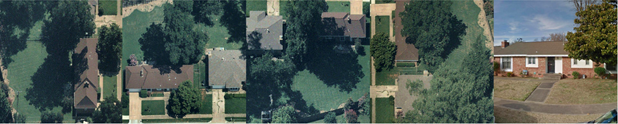

# Roof Slope – Labeling Instructions

## Overview

In this task, you will label roof panels using the polygon tool. There are 3 distinct types of panels:

class 1|class 2|class 3
:-----:|:-----:|:-----:
FLAT    | LOW | STEEP

## Instructions

1. Review the image to identify the roofs and pick a starting point.
1. Zoom in to get a better view before drawing any polygons.
1. Draw a separate polygon around **each roof panel**.
1. Zoom out to check the image carefully for any missed roof panels.
1. Lable around obstructions.

## Objective 
Label each roof panel on every roof visible as either FLAT, LOW, or STEEP.

## Orientation

image | Description
:-----:|:-----:
 |See below

Labelbox will provide you with an image like the one above. This example shows the best-case scenario. There are four (oblique) images running from left to right that show the same houses from different directions. The rightmost image is a Google Streetview image. The Streetview image is provided as an additional resource to help you determine the roof slope. DO NOT LABEL THE STREETVIEW IMAGE
